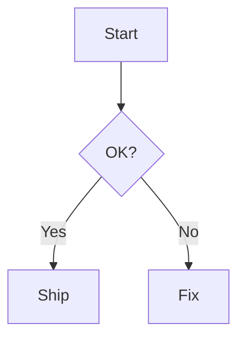
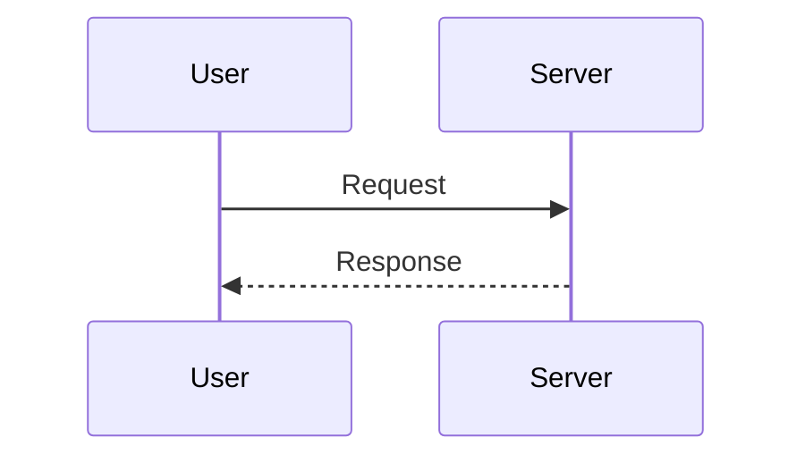

# Mermaid Diagrams

The Dux theme ships Mermaid-friendly styles. Use the minimal config via `withDuxTheme`, then you can write Mermaid diagrams directly in Markdown.

## Install

If you haven’t installed the theme yet, install it first:

```bash
# pnpm
pnpm add @duxweb/vitepress-theme

# npm
npm i @duxweb/vitepress-theme

# yarn
yarn add @duxweb/vitepress-theme
```

## Minimal config

Use the minimal config in `.vitepress/config.ts` or `.vitepress/config.mts`:

```ts
import { withDuxTheme } from '@duxweb/vitepress-theme/config'

export default withDuxTheme({
  // other config...
  // mermaidPlugin is optional: customize Mermaid behavior
  mermaidPlugin: {}
})
```

> This repo’s `packages/docs` is already configured by default.

## Rendered Example

Here is a rendered Mermaid diagram:



## Use in Markdown

Write Mermaid code blocks in Markdown:

````md

````

Sequence diagram example (code):

````md

````

## Troubleshooting

- If styles look off, make sure `mermaidPlugin.class` includes `dux-mermaid`.
- If nothing renders, make sure dependencies are installed and restart the dev server.
