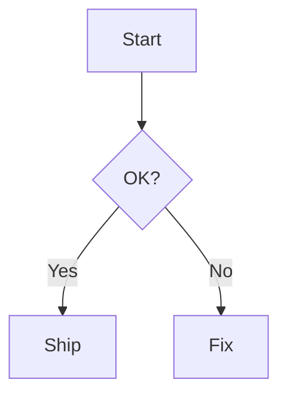
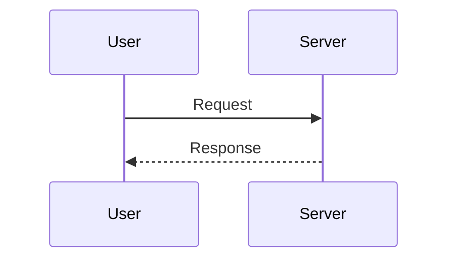

# Mermaid 图表

Dux 主题已内置 Mermaid 运行时渲染与样式。你只需使用主题，即可在 Markdown 中直接使用流程图、时序图等。

## 安装依赖

如果还没安装主题，请先安装：

```bash
# pnpm
pnpm add @duxweb/vitepress-theme

# npm
npm i @duxweb/vitepress-theme

# yarn
yarn add @duxweb/vitepress-theme
```

## 推荐配置

在 `.vitepress/config.ts` 或 `.vitepress/config.mts` 中使用最小化配置：

```ts
import { withDuxTheme } from '@duxweb/vitepress-theme/config'

export default withDuxTheme({
  // 其他配置...
})
```

> 本仓库的 `packages/docs` 已默认集成，无需重复配置。

## 渲染示例

下面是一个实际渲染的 Mermaid 图：



## Markdown 中使用

直接在 Markdown 中使用 Mermaid 代码块：

````md

````

时序图示例（代码）：

````md

````

## 常见问题

- 如果图表无法渲染，确认主题已升级并重新启动开发服务。
