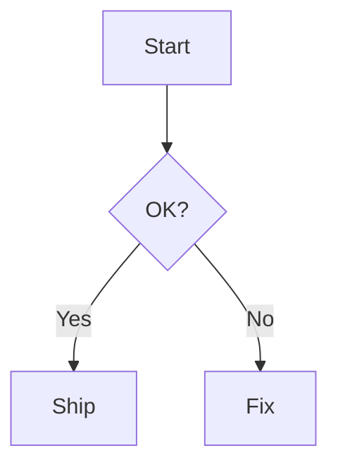

# @duxweb/vitepress-theme

现代、优雅、可定制的 VitePress 文档主题，适合技术文档与项目站点。

- ✨ 现代设计 · 亮/暗色支持
- 🌍 多语言 · 语言跳转页
- 📚 多布局 · Home / Doc / Page / Sponsor / Changelog / Jump
- 🔍 本地搜索 · MiniSearch 集成
- 🧩 Mermaid · 内置样式与快速集成

## 环境要求
- Node.js ≥ 18
- VitePress ^1.6.4

## 快速使用

### 1. 安装主题
```bash
pnpm add @duxweb/vitepress-theme
# 或
npm i @duxweb/vitepress-theme
```

### 2. 最小化配置（推荐）
`withDuxTheme` 会自动注入 `vite.ssr.noExternal`、`optimizeDeps.exclude`，同时启用 Mermaid 集成。

```ts
// .vitepress/config.mts
import { withDuxTheme } from '@duxweb/vitepress-theme/config'

export default withDuxTheme({
  title: 'My Docs',
  description: 'Modern VitePress Theme',
  themeConfig: {
    nav: [
      { text: 'Guide', link: '/guide/' },
      { text: 'Reference', link: '/reference/' }
    ]
  },
  // mermaidPlugin 可选：用于自定义 Mermaid 行为
  mermaidPlugin: {}
})
```

### 3. 扩展主题
在 `.vitepress/theme/index.ts` 中：

```ts
// .vitepress/theme/index.ts
import theme from '@duxweb/vitepress-theme'
import '@duxweb/vitepress-theme/dist/index.css'

export default {
  extends: theme
}
```

> 提示：主题 CSS 已为编译产物，通常无需再次压缩。

## 最小化配置（推荐）
在 `.vitepress/config.mts` 中使用：

```ts
import { withDuxTheme } from '@duxweb/vitepress-theme/config'

export default withDuxTheme({
  // 其他配置...
  // mermaidPlugin 可选：用于自定义 Mermaid 行为
  mermaidPlugin: {}
})
```

Markdown 中直接使用：

````md

````

## 搜索功能说明
- 主题内置本地搜索，已实现"动态导入 + 优雅降级"
- 使用 `withDuxTheme` 时会自动注入所需 Vite 配置，搜索可完整启用

## 首页示例
```md
---
layout: home
hero:
  name: My Project
  text: Modern VitePress Theme
  actions:
    - theme: brand
      text: Get Started
      link: /guide/
features:
  - icon: ⚡
    title: Fast
    details: Built on VitePress
---
```

## 许可证
MIT
